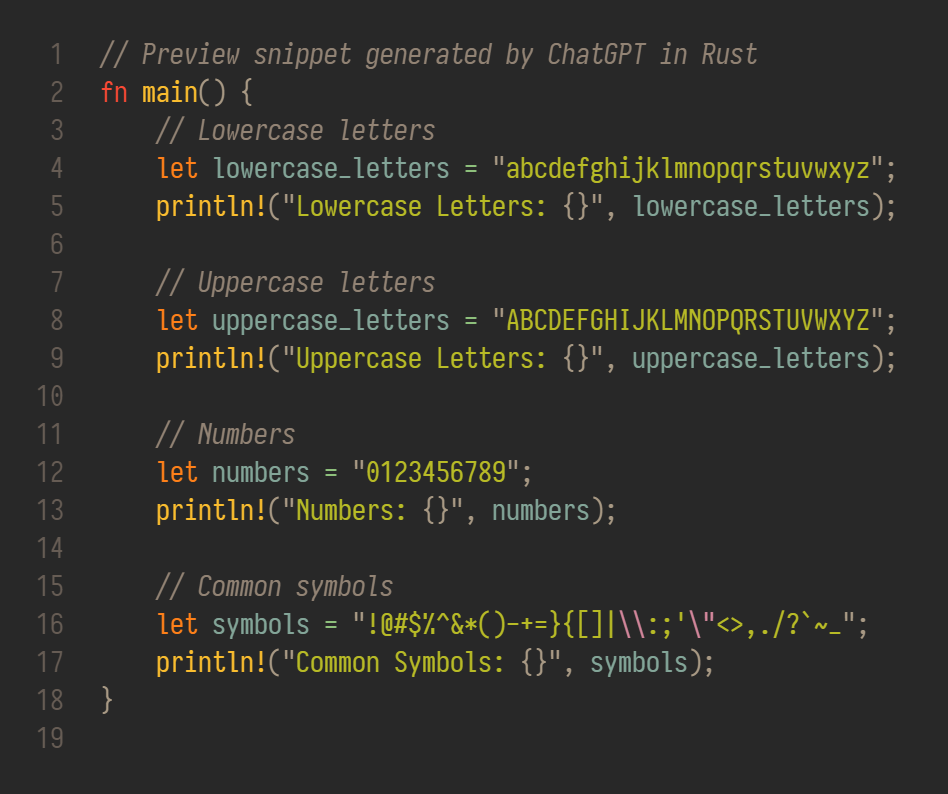

# Iosevkata

A `PragmataPro` (ss08) styled `Iosevka` variant with my tweaks.

[](https://garnix.io/repo/ningw42/Iosevkata)




## Usage

This repository produces two types of artifact:
1. Zipballs with TTF fonts. [Download the latest release](https://github.com/ningw42/Iosevkata/releases/latest) and install on your system. This should be most common/universal use case.
2. A nix package for `x86_64-linux`, `x86_64-darwin` and `aarch64-darwin`. Add `ningw42/Iosevkata` to your flake.
    1. Use the package `packages.<system>.iosevkata` directly, which comes with all the variants.
    2. Use overlay `overlays.default` from the flake when importing nixpkgs, which adds `iosevkata` (with all variants) to your nixpkgs.
    3. If you want pre-built packages, follow [garnix's guide for adding garnix's public binary caching server](https://garnix.io/docs/caching). **DO NOT** override `nixpkgs` with `inputs.nixpkgs.follows`, otherwise you will have to build the package your self.

## Customization

1. **A fixed spacing, no ligature.** I once liked ligature, but it's distracting.
2. **A higher underscore.** To make underscore-connected characters feels connected, like `Menlo`.
3. **A lower hex asterisk.** To place asterisk at the vertical center of the line, like `Menlo`.
4. **An oval-dotted zero.** `PragmataPro`'s diamond shaped zero is too sharp for me.
5. **A few decorations mimicking `mononoki`.** For 'B', 'D', 'P' and 'R'.

## Variants

1. Iosevkata, vanilla Iosevka with the tweaks above.
2. Iosevkata Nerd Font, [Nerd Fonts](https://github.com/ryanoasis/nerd-fonts) glyphs are patched in the same way as the official "Nerd Font" variant, "a somehow monospaced variant, maybe". See [ryanoasis/nerd-fonts#1103](https://github.com/ryanoasis/nerd-fonts/discussions/1103).
3. Iosevkata Nerd Font Mono, [Nerd Fonts](https://github.com/ryanoasis/nerd-fonts) glyphs are patched in the same way as the official "Nerd Font Mono" variant, "a strictly monospaced variant". See [ryanoasis/nerd-fonts#1103](https://github.com/ryanoasis/nerd-fonts/discussions/1103).

## TODOs

- [x] Add a `Iosevkata Nerd Font` with [Nerd Fonts Patcher](https://github.com/ryanoasis/nerd-fonts#font-patcher).
- [x] A unified builder.
- [x] Run NerdFontPatcher in parallel. Now we just need 3 minutes on an AMD Ryzen 9 3900X compare to 15 minutes when patching is done sequentially.
- [x] Honor `NIX_BUILD_CORES`.
- [x] Add preview image.
- [x] Prefetch script.
- [x] Larger period size in punctuation.
- [x] Build and release with GitHub Actions.
- [x] Switch to [calendar versioning](https://calver.org/) to decouple from Iosevka's semantic versioning.
- [ ] Add `zstd` compressed artifacts.
- [ ] Generate preview automatically in GitHub Actions with colorscheme applied.
- [ ] Put the glyphs from Nerd Fonts at the horizontal center of the cell/grid. See [ryanoasis/nerd-fonts#1644](https://github.com/ryanoasis/nerd-fonts/discussions/1644#discussioncomment-9600894).

## Build

You will need [Nix or NixOS](https://nixos.org/), and [Flake](https://nixos.wiki/wiki/Flakes).

```bash
# All variants at once for a nix package
nix build .#iosevkata
# All variants at once for zipballs
nix build .#iosevkata-release

# Iosevkata, a nix package
nix build .#iosevkata-only
# Iosevkata Nerd Font, a nix package
nix build .#iosevkata-nerd-font-only
# Iosevkata Nerd Font Mono, a nix package
nix build .#iosevkata-nerd-font-mono-only
```

## Update
```bash
# enter nix shell with necessary dependencies
nix develop .

# prefetch checksums with the latest Iosevka and nerd-fonts
./prefetch_checksums.sh

# prefetch checksums with the specified Iosevka and nerd-fonts
./prefetch_checksums.sh $iosevka_version $nerdfontpatcher_version # e.g. ./prefetch_checksums.sh 30.3.0 3.2.1

# review the updated flake.nix
```

## Versions

Iosevkata has decoupled its version for calendar versioning from Iosevka's semantic versioning since Iosevka v33.0.1. Here is the version mapping.

| Iosevkata | Iosevka | nerd-fonts |
| :-------- | :------ | :--------- |
| v25.04.0  | v33.2.1 | v3.3.0     |
| v25.03.2  | v33.2.0 | v3.3.0     |
| v25.03.1  | v33.1.0 | v3.3.0     |
| v25.03.0  | v33.0.1 | v3.3.0     |


## References
1. [Iosevka](https://github.com/be5invis/Iosevka)
2. [PragmataPro](https://fsd.it/shop/fonts/pragmatapro/)
3. [Menlo](https://en.wikipedia.org/wiki/Menlo_(typeface))
4. [mononoki](https://github.com/madmalik/mononoki)

## Other Similar Fonts

1. [Pragmasevka](https://github.com/shytikov/pragmasevka), a `Iosevka` variant solely intended to immitate `PragmataPro`.
2. [Iosvmata](https://github.com/N-R-K/Iosvmata), a `Pragmasevka` based `Iosevka` variant.
