# Iosevkata

A `PragmataPro` (ss08) styled `Iosevka` variant with my tweaks.

[](https://github.com/ningw42/Iosevkata/releases/latest)
[](https://github.com/ningw42/Iosevkata/releases)

[](https://garnix.io/repo/ningw42/Iosevkata)

[](https://github.com/ningw42/Iosevkata/actions/workflows/check_dependency_update.yml)
[](https://github.com/ningw42/Iosevkata/actions/workflows/tag_on_auto_update_merge.yml)
[](https://github.com/ningw42/Iosevkata/actions/workflows/build_and_publish_release.yml)
[](https://github.com/ningw42/Iosevkata/actions/workflows/build_and_push_to_cachix.yml)
[](https://github.com/ningw42/Iosevkata/actions/workflows/generate_previews.yml)

## Previews

<details>
    <summary>Catppuccin 🌻 Latte</summary>
    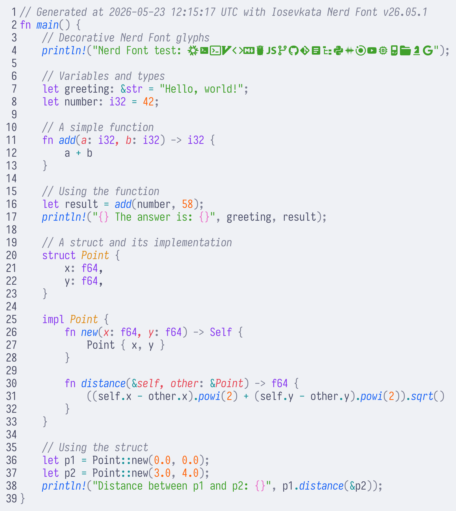
</details>
<details>
    <summary>Catppuccin 🪴 Frappé</summary>
    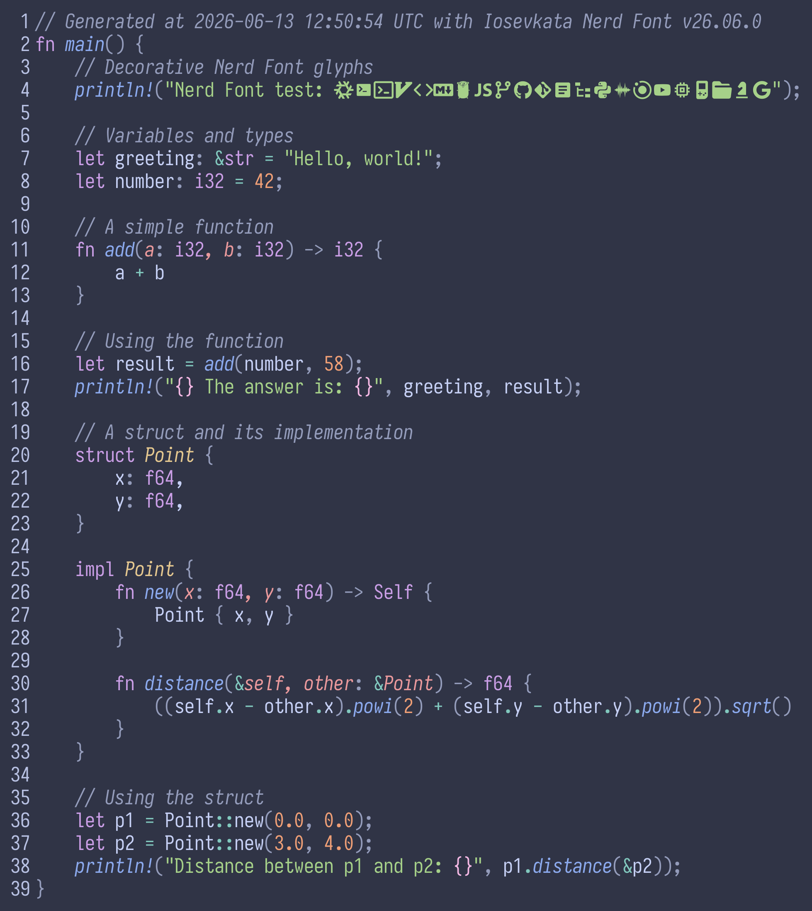
</details>
<details>
    <summary>Catppuccin 🌺 Macchiato</summary>
    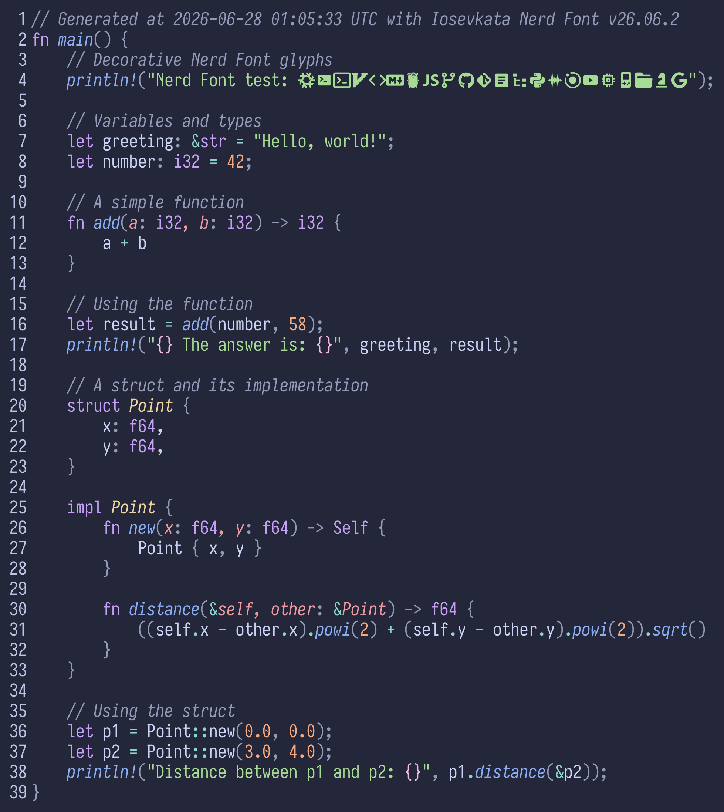
</details>
<details>
    <summary>Catppuccin 🌿 Mocha</summary>
    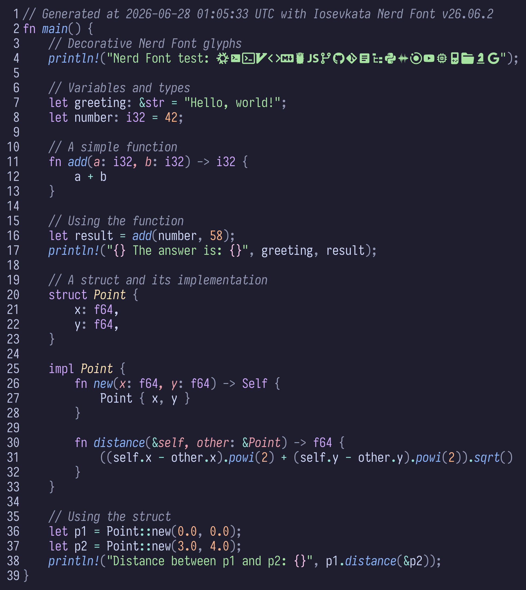
</details>
<details>
    <summary>Everforest Light</summary>
    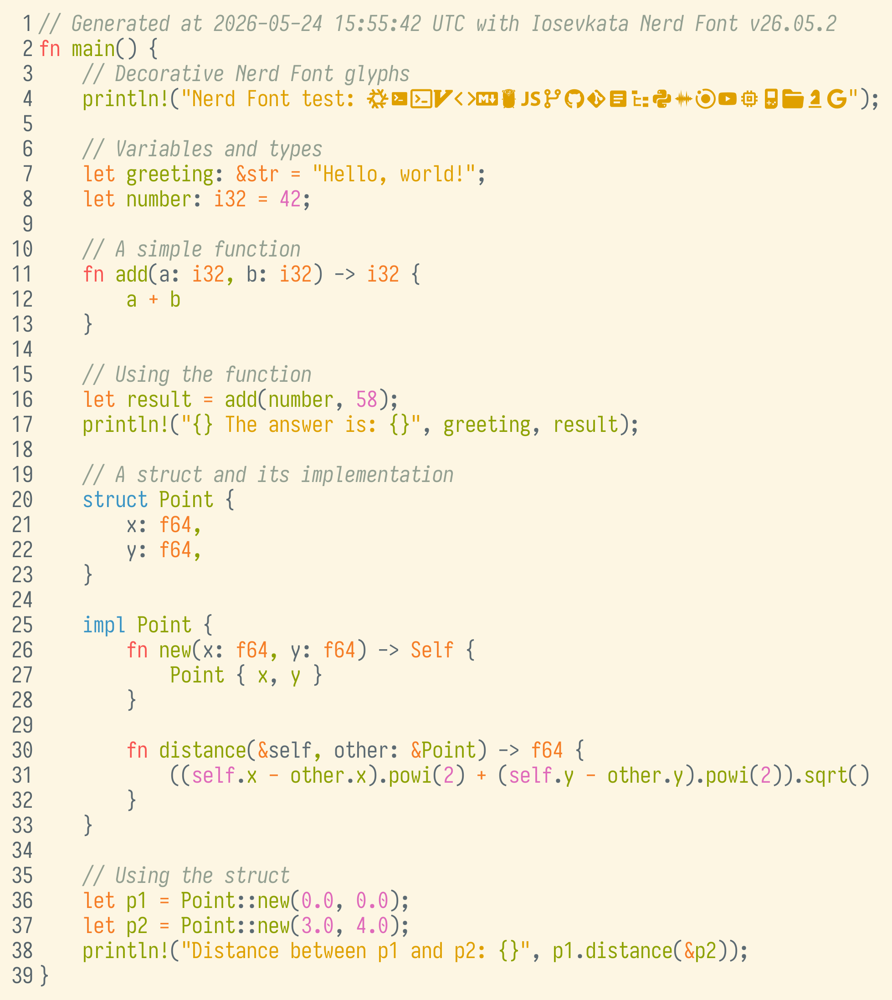
</details>
<details>
    <summary>Everforest Dark</summary>
    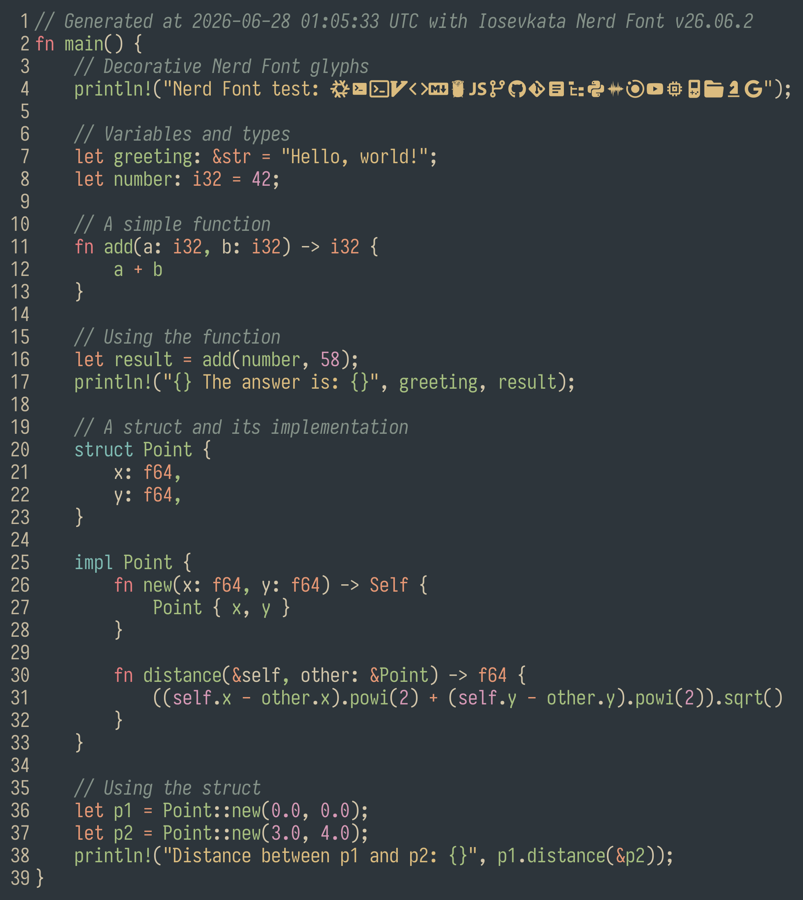
</details>
<details>
    <summary>Gruvbox Light</summary>
    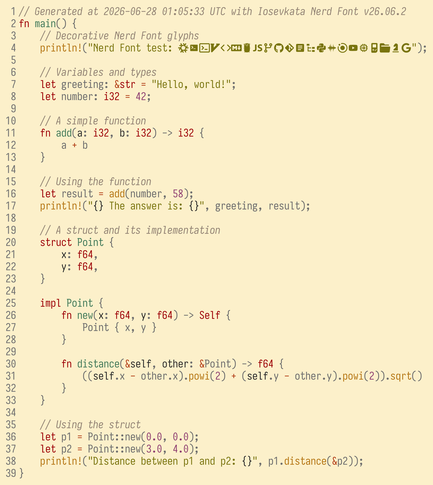
</details>
<details>
    <summary>Gruvbox Dark</summary>
    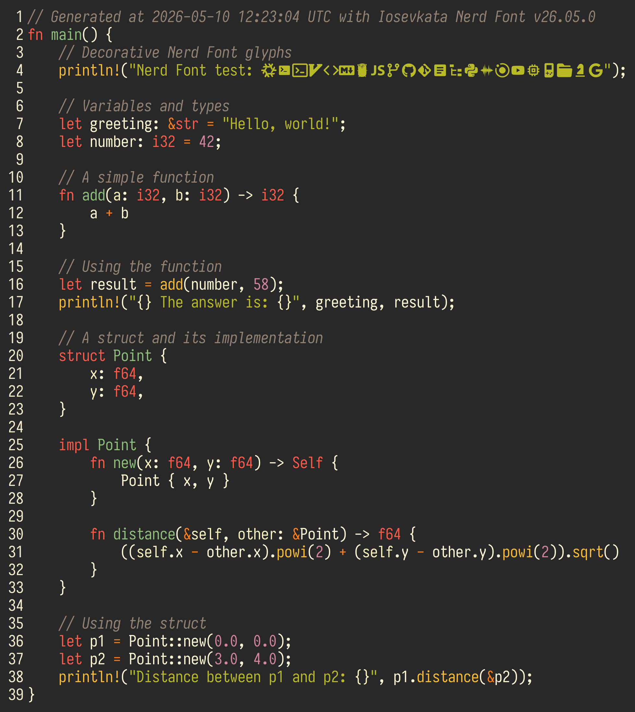
</details>
<details>
    <summary>Rosé Pine Dawn</summary>
    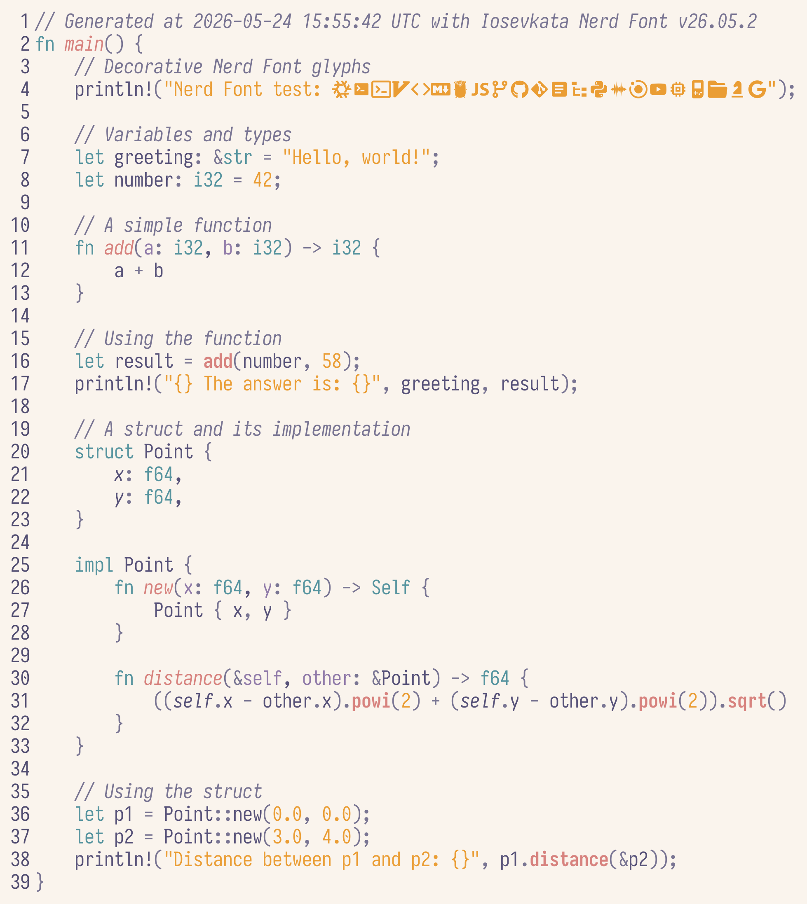
</details>
<details>
    <summary>Rosé Pine Moon</summary>
    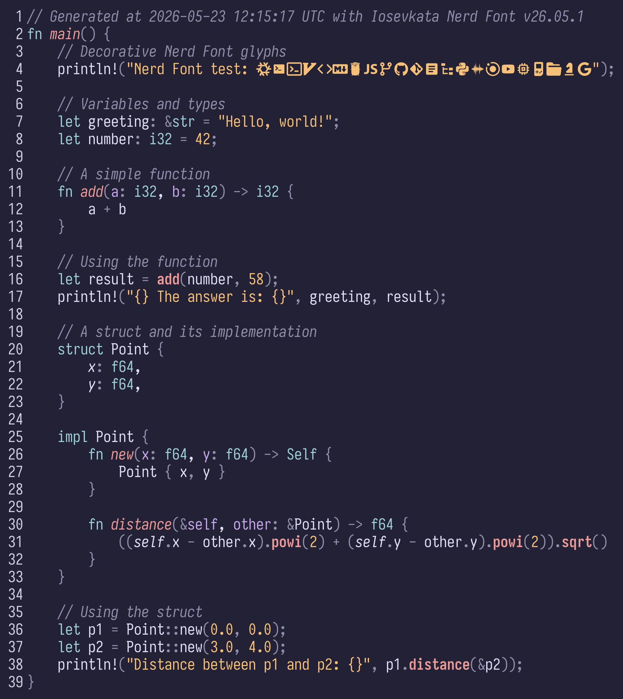
</details>
<details>
    <summary>Rosé Pine</summary>
    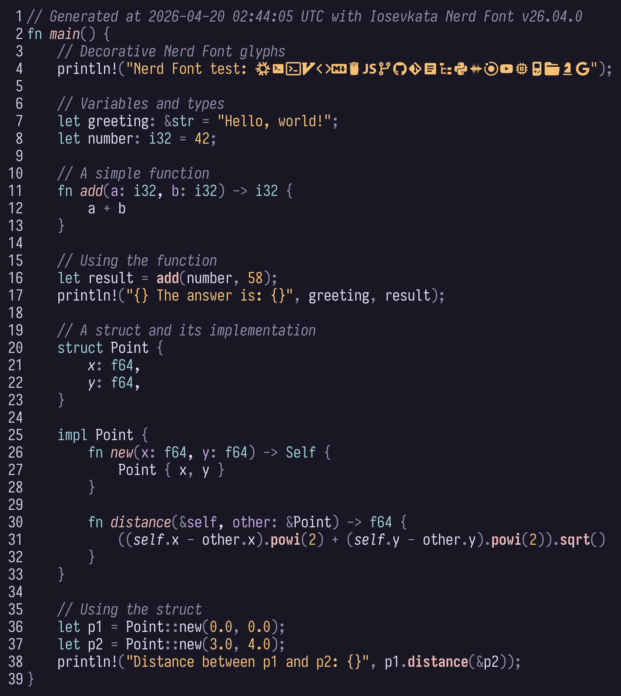
</details>

## Usage

This repository produces two types of artifact:
1. Compressed TTF fonts. [Download the latest release](https://github.com/ningw42/Iosevkata/releases/latest) and install on your system. This should be most common/universal use case.
2. A nix package for `x86_64-linux`, `x86_64-darwin` and `aarch64-darwin`. Add `ningw42/Iosevkata` to your flake.
    1. Use the package `packages.<system>.iosevkata` directly, which comes with all the variants.
    2. Use overlay `overlays.default` from the flake when importing nixpkgs, which adds `iosevkata` (with all variants) to your nixpkgs.
    3. If you want pre-built packages, follow [garnix's guide for adding garnix's public binary caching server](https://garnix.io/docs/caching), or add [`iosevkata.cachix.org`](https://app.cachix.org/cache/iosevkata) as a substituter (public key: `iosevkata.cachix.org-1:TJHxbWCX5n7lt4pL2E5ES4cminyhovx1LOJx2FJ2SE4=`). **DO NOT** override `nixpkgs` with `inputs.nixpkgs.follows`, otherwise you will have to build the package your self.

## Customization

1. **A fixed spacing, no ligature.** I once liked ligature, but it's distracting.
2. **A higher underscore.** To make underscore-connected characters feels connected, like `Menlo`.
3. **A lower hex asterisk.** To place asterisk at the vertical center of the line, like `Menlo`.
4. **An oval-reverse-slashed-split zero.** `PragmataPro`'s diamond-reverse-slashed-split is too sharp for me.
5. **A few decorations mimicking `mononoki`.** For 'B', 'D', 'P' and 'R'.

## Variants

1. Iosevkata, vanilla Iosevka with the tweaks above.
2. Iosevkata Nerd Font, [Nerd Fonts](https://github.com/ryanoasis/nerd-fonts) glyphs are patched in the same way as the official "Nerd Font" variant, "a somehow monospaced variant, maybe". See [ryanoasis/nerd-fonts#1103](https://github.com/ryanoasis/nerd-fonts/discussions/1103).
3. Iosevkata Nerd Font Mono, [Nerd Fonts](https://github.com/ryanoasis/nerd-fonts) glyphs are patched in the same way as the official "Nerd Font Mono" variant, "a strictly monospaced variant". See [ryanoasis/nerd-fonts#1103](https://github.com/ryanoasis/nerd-fonts/discussions/1103).

## TODOs

- [x] Add a `Iosevkata Nerd Font` with [Nerd Fonts Patcher](https://github.com/ryanoasis/nerd-fonts#font-patcher).
- [x] A unified builder.
- [x] Run NerdFontPatcher in parallel. Now we just need 3 minutes on an AMD Ryzen 9 3900X compare to 15 minutes when patching is done sequentially.
- [x] Honor `NIX_BUILD_CORES`.
- [x] Add preview image.
- [x] Prefetch script.
- [x] Larger period size in punctuation.
- [x] Build and release with GitHub Actions.
- [x] Switch to [calendar versioning](https://calver.org/) to decouple from Iosevka's semantic versioning.
- [x] Patch Nerd Fonts glyphs at the horizontal center of two cells, instead of the left aligned default. See [ryanoasis/nerd-fonts#1330](https://github.com/ryanoasis/nerd-fonts/issues/1330#issuecomment-1664025541).
- [x] Add `zstd` compressed artifacts.
- [x] Generate preview automatically in GitHub Actions with colorscheme applied.

## Build

You will need [Nix or NixOS](https://nixos.org/), and [Flake](https://nixos.wiki/wiki/Flakes).

```bash
# All variants at once for a nix package
nix build .#iosevkata
# All variants at once for zipballs
nix build .#iosevkata-release

# Iosevkata, a nix package
nix build .#iosevkata-only
# Iosevkata Nerd Font, a nix package
nix build .#iosevkata-nerd-font-only
# Iosevkata Nerd Font Mono, a nix package
nix build .#iosevkata-nerd-font-mono-only
```

## Cache

Binaries are pushed to [iosevkata.cachix.org](https://app.cachix.org/cache/iosevkata). To push from local after running `cachix authtoken <token>` once:

```bash
cachix watch-exec iosevkata -- nix build .#iosevkata
# or, without installing cachix:
nix run nixpkgs#cachix -- watch-exec iosevkata -- nix build .#iosevkata
```

## Update
```bash
# enter nix shell with necessary dependencies
nix develop .
# nix shell uses bash by default, if you want to use your shell
nix develop . --command $YOUR_SHELL

# print help message
./updater.py --help

# prefetch checksums with the latest Iosevka
./updater.py

# prefetch checksums with the specified Iosevka version
# e.g. ./updater.py --target-iosevka-version 30.3.0
./updater.py --target-iosevka-version $iosevka_version

# update nerd-font-patcher flake input
nix flake update nerd-font-patcher

# review the updated flake.nix and versions.md
```

## Versions

Iosevkata has decoupled its version for calendar versioning from Iosevka's semantic versioning since Iosevka v33.0.1. Checkout [versions.md](./versions.md) for the version mapping.

## References
1. [Iosevka](https://github.com/be5invis/Iosevka)
2. [PragmataPro](https://fsd.it/shop/fonts/pragmatapro/)
3. [Menlo](https://en.wikipedia.org/wiki/Menlo_(typeface))
4. [mononoki](https://github.com/madmalik/mononoki)

## Other Similar Fonts

1. [Pragmasevka](https://github.com/shytikov/pragmasevka), Pragmata Pro doppelgänger made of Iosevka SS08.
2. [Iosvmata](https://github.com/N-R-K/Iosvmata), Custom Iosevka build somewhat mimicking PragmataPro.
